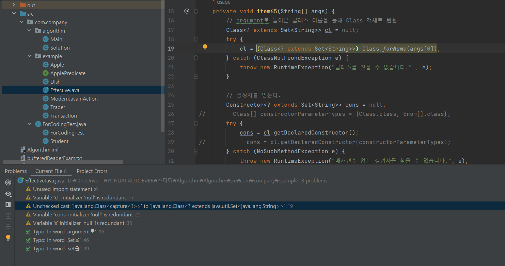

# item34. int 상수 대신 열거 타입(enum)을 사용하라.

자바에서 열거 타입을 지원하기 전에는 다음 코드처럼 정수 상수를 한 묶음으로 선언한 정수 열거 패턴(int enum pattern) 기법을 사용했다.

```java
public static final int APPLE_FUJI         = 0;
public static final int APPLE_PIPPIN       = 1;
public static final int APPLE_GRANNY_SMITH = 2;

public static final int ORANGE_NAVEL  = 0;
public static final int ORANGE_TEMPLE = 1;
public static final int ORANGE_BLOOD  = 2;
```


## 정수 열거 패턴(int enum pattern) 기법의 단점

### 타입 안전을 보장할 방법이 없다.

오렌지를 건네야 할 메소드에 사과를 보내고 동등 연산자(==)로 비교하더라도 컴파일러는 아무런 경고 메시지를 출력하지 않는다.&#x20;

### 표현력이 좋지 않다.&#x20;

자바가 int enum pattern을 위한 별도의 이름공간(namespace)를 지원하지 않기 때문에 어쩔 수 없이 접두어를 써서 이름 충돌을 방지해야 한다.

* 사과용 상수 이름은 모두 APPLE\_로 시작하고, 오렌지용 상수는 ORANGE\_로 시작한다.
* ex) 영어로는 둘 다 mercury인 수은(원소)과 수성(행성)을 각각 ELEMENT\_MERCURY와 PLANET\_MERCURY로 지어 구분

### 깨지기 쉽다.&#x20;

상수의 값이 바뀌면 클라이언트도 반드시 다시 컴파일해야 한다. 다시 컴파일하지 않은 클라이언트는 엉뚱하게 동작하게 된다.&#x20;

### 정수 상수는 문자열로 출력하기가 다소 까다롭다.

그 값을 출력하거나 디버거로 살펴보면 단지 숫자로만 보여서 썩 도움이 되지 않는다.&#x20;

<mark style="color:yellow;">Q) 알아볼 수 있게 정수 대신 문자열 상수를 사용하면 되는 거 아니야?</mark>

\--> 문자열 열거 패턴(string enum pattern)이라 하는 이 변형은 문자열 비교에 따른 성능 저하가 생긴다.

### 같은 정수 열거 그룹에 속한 모든 상수를 한 바퀴 순회하는 방법도 마땅치 않다.&#x20;


## 열거 타입(enum type)


```java
public enum Apple { FUJI, PIPPIN, GRANNY_SMITH }
public enum Orange { NAVEL, TEMPLE, BLOOD }
```


### 열거 타입 객체의 메소드

| return type  | method(parameter)    | description           |
| ------------ | -------------------- | --------------------- |
| String       | name()               | 열거 객체의 문자열을 리턴        |
| int          | ordinal()            | 열거 객체의 순번(0부터 시작)을 리턴 |
| int          | compareTo()          | 열거 객체를 비교해서 순번 차이를 리턴 |
| enum type    | valueOf(String name) | 주어진 문자열의 열거 객체를 리턴    |
| enum type\[] | values()             | 모든 열거 객체들을 배열로 리턴     |

### 열거 타입의 아이디어

* 열거 타입 자체는 클래스이며, 상수 하나 당 자신의 인스턴스를 하나씩 만들어 public static final 필드로 공개한다.

<figure><figcaption></figcaption></figure>

<figure><figcaption><p>명시하지 않아도 static final 필드로 선언</p></figcaption></figure>

* 열거 타입은 밖에서 접근할 수 있는 생성자를 제공하지 않으므로 사실상 final이다.&#x20;
  * 따라서 클라이언트가 인스턴스를 직접 생성하거나 확장할 수 없다.
  * 열거 타입 선언으로 만들어진 인스턴스들은 딱 하나씩만 존재함이 보장된다.
  * 싱글턴은 원소가 하나뿐인 열거 타입이라 할 수 있고, 거꾸로 열거 타입은 싱글턴을 일반화한 형태이다.&#x20;

## 열거 타입 사용 Example

### 상수 각각을 특정 데이터와 연결

열거 타입 상수 각각을 특정 데이터와 연결지으려면 생성자에서 데이터를 받아 인스턴스 필드에 저장하면 된다.&#x20;

```java
package com.company.effectiveJava.item34;

// 코드 34-3 데이터와 메서드를 갖는 열거 타입 (211쪽)
public enum Planet {
    MERCURY(3.302e+23, 2.439e6),
    VENUS(4.869e+24, 6.052e6),
    EARTH(5.975e+24, 6.378e6),
    MARS(6.419e+23, 3.393e6),
    JUPITER(1.899e+27, 7.149e7),
    SATURN(5.685e+26, 6.027e7),
    URANUS(8.683e+25, 2.556e7),
    NEPTUNE(1.024e+26, 2.477e7);

    private final double mass;           // 질량(단위: 킬로그램)
    private final double radius;         // 반지름(단위: 미터)
    private final double surfaceGravity; // 표면중력(단위: m / s^2)

    // 중력상수(단위: m^3 / kg s^2)
    private static final double G = 6.67300E-11;

    // 생성자
    Planet(double mass, double radius) {
        this.mass = mass;
        this.radius = radius;
        surfaceGravity = G * mass / (radius * radius);
    }

    public double mass()           { return mass; }
    public double radius()         { return radius; }
    public double surfaceGravity() { return surfaceGravity; }

    public double surfaceWeight(double mass) {
        return mass * surfaceGravity;  // F = ma
    }
}
```

```java
package com.company.effectiveJava.item34;

// 어떤 객체의 지구에서의 무게를 입력받아 여덟 행성에서의 무게를 출력한다. (212쪽)
public class WeightTable {
    public static void main(String[] args) {
        double earthWeight = Double.parseDouble(args[0]);
        double mass = earthWeight / Planet.EARTH.surfaceGravity();
        for (Planet p : Planet.values())
            System.out.printf("%s에서의 무게는 %f이다.%n",
                    p, p.surfaceWeight(mass));
    }
}
```

<mark style="color:yellow;">Q) 열거 타입에서 상수를 하나 제거하면?</mark>

* 제거한 상수를 참조하지 않는 클라이언트에는 영향 X
  * WeightTable 프로그램에서라면 단지 출력하는 줄 수가 하나 줄어들 뿐이다.&#x20;
* 제거된 상수를 참조하는 클라이언트는 제거된 상수를 참조하는 줄에서 컴파일 오류가 발생해 이에 대해 컴파일 시에 대응 가능


### 상수마다 동작이 달라져야 한다면?

위에서 Planet 상수들은 서로 다른 데이터와 연결되는 데 그쳤지만, 한 걸음 더 나아가 상수마다 동작이 달라져야 하는 상황도 있다.&#x20;

