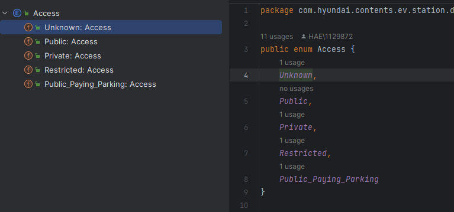

# item34. int 상수 대신 열거 타입(enum)을 사용하라.

자바에서 열거 타입을 지원하기 전에는 다음 코드처럼 정수 상수를 한 묶음으로 선언한 정수 열거 패턴(int enum pattern) 기법을 사용했다.

```java
public static final int APPLE_FUJI         = 0;
public static final int APPLE_PIPPIN       = 1;
public static final int APPLE_GRANNY_SMITH = 2;

public static final int ORANGE_NAVEL  = 0;
public static final int ORANGE_TEMPLE = 1;
public static final int ORANGE_BLOOD  = 2;
```


## 정수 열거 패턴(int enum pattern) 기법의 단점

### 타입 안전을 보장할 방법이 없다.

오렌지를 건네야 할 메소드에 사과를 보내고 동등 연산자(==)로 비교하더라도 컴파일러는 아무런 경고 메시지를 출력하지 않는다.&#x20;

### 표현력이 좋지 않다.&#x20;

자바가 int enum pattern을 위한 별도의 이름공간(namespace)를 지원하지 않기 때문에 어쩔 수 없이 접두어를 써서 이름 충돌을 방지해야 한다.

* 사과용 상수 이름은 모두 APPLE\_로 시작하고, 오렌지용 상수는 ORANGE\_로 시작한다.
* ex) 영어로는 둘 다 mercury인 수은(원소)과 수성(행성)을 각각 ELEMENT\_MERCURY와 PLANET\_MERCURY로 지어 구분

### 깨지기 쉽다.&#x20;

상수의 값이 바뀌면 클라이언트도 반드시 다시 컴파일해야 한다. 다시 컴파일하지 않은 클라이언트는 엉뚱하게 동작하게 된다.&#x20;

### 정수 상수는 문자열로 출력하기가 다소 까다롭다.

그 값을 출력하거나 디버거로 살펴보면 단지 숫자로만 보여서 썩 도움이 되지 않는다.&#x20;

<mark style="color:yellow;">Q) 알아볼 수 있게 정수 대신 문자열 상수를 사용하면 되는 거 아니야?</mark>

\--> 문자열 열거 패턴(string enum pattern)이라 하는 이 변형은 문자열 비교에 따른 성능 저하가 생긴다.

### 같은 정수 열거 그룹에 속한 모든 상수를 한 바퀴 순회하는 방법도 마땅치 않다.&#x20;


## 열거 타입(enum type)


```java
public enum Apple { FUJI, PIPPIN, GRANNY_SMITH }
public enum Orange { NAVEL, TEMPLE, BLOOD }
```


### 열거 타입 객체의 메소드

| return type  | method(parameter)    | description           |
| ------------ | -------------------- | --------------------- |
| String       | name()               | 열거 객체의 문자열을 리턴        |
| int          | ordinal()            | 열거 객체의 순번(0부터 시작)을 리턴 |
| int          | compareTo()          | 열거 객체를 비교해서 순번 차이를 리턴 |
| enum type    | valueOf(String name) | 주어진 문자열의 열거 객체를 리턴    |
| enum type\[] | values()             | 모든 열거 객체들을 배열로 리턴     |

### 열거 타입의 아이디어

* 열거 타입 자체는 클래스이며(변수와 메소드, 생성자를 가질 수 있다.), 상수 하나 당 자신의 인스턴스를 하나씩 만들어 public static final 필드로 공개한다.

<figure><figcaption><p>명시하지 않아도 static final 필드로 선언</p></figcaption></figure>

* 열거 타입은 밖에서 접근할 수 있는 생성자를 제공하지 않으므로 사실상 final이다.&#x20;
  * 따라서 클라이언트가 인스턴스를 직접 생성하거나 확장할 수 없다.
  * 열거 타입 선언으로 만들어진 인스턴스들은 딱 하나씩만 존재함이 보장된다.
  * 싱글턴은 원소가 하나뿐인 열거 타입이라 할 수 있고, 거꾸로 열거 타입은 싱글턴을 일반화한 형태이다.&#x20;

## 열거 타입 사용 Example

### 상수 각각을 특정 데이터와 연결

열거 타입 상수 각각을 특정 데이터와 연결지으려면 생성자에서 데이터를 받아 인스턴스 필드에 저장하면 된다.&#x20;


```java
package com.company.effectiveJava.item34;

// 코드 34-3 데이터와 메서드를 갖는 열거 타입 (211쪽)
public enum Planet {
    MERCURY(3.302e+23, 2.439e6),
    VENUS(4.869e+24, 6.052e6),
    EARTH(5.975e+24, 6.378e6),
    MARS(6.419e+23, 3.393e6),
    JUPITER(1.899e+27, 7.149e7),
    SATURN(5.685e+26, 6.027e7),
    URANUS(8.683e+25, 2.556e7),
    NEPTUNE(1.024e+26, 2.477e7);

    // 열거 타입은 근본적으로 불변이라 모든 필드가 final이어야 한다.
    // 필드를 public으로 선언해도 되지만, private으로 두고 별도의 public 접근자 메소드를 두자. (item16)
    private final double mass;           // 질량(단위: 킬로그램)
    private final double radius;         // 반지름(단위: 미터)
    private final double surfaceGravity; // 표면중력(단위: m / s^2)

    // 중력상수(단위: m^3 / kg s^2)
    private static final double G = 6.67300E-11;

    // 생성자
    Planet(double mass, double radius) {
        this.mass = mass;
        this.radius = radius;
        surfaceGravity = G * mass / (radius * radius);
    }

    public double mass()           { return mass; }
    public double radius()         { return radius; }
    public double surfaceGravity() { return surfaceGravity; }

    public double surfaceWeight(double mass) {
        return mass * surfaceGravity;  // F = ma
    }
}
```


```java
package com.company.effectiveJava.item34;

// 어떤 객체의 지구에서의 무게를 입력받아 여덟 행성에서의 무게를 출력한다. (212쪽)
public class WeightTable {
    public static void main(String[] args) {
        double earthWeight = Double.parseDouble(args[0]);
        double mass = earthWeight / Planet.EARTH.surfaceGravity();
        for (Planet p : Planet.values())
            System.out.printf("%s에서의 무게는 %f이다.%n",
                    p, p.surfaceWeight(mass));
    }
}
```

<mark style="color:yellow;">Q) 열거 타입에서 상수를 하나 제거하면?</mark>

* 제거한 상수를 참조하지 않는 클라이언트에는 영향 X
  * WeightTable 프로그램에서라면 단지 출력하는 줄 수가 하나 줄어들 뿐이다.&#x20;
* 제거된 상수를 참조하는 클라이언트는 제거된 상수를 참조하는 줄에서 컴파일 오류가 발생해 이에 대해 컴파일 시에 대응 가능


### 상수마다 동작이 달라져야 한다면?

위에서 Planet 상수들은 서로 다른 데이터와 연결되는 데 그쳤지만, 한 걸음 더 나아가 상수마다 동작이 달라져야 하는 상황도 있다.&#x20;

ex) 사칙연산 계산기의 연산 종류를 열거 타입으로 선언하고, 실제 연산까지 열거 타입 상수가 직접 수행했으면 하는 경우

먼저, switch문을 이용해 상수의 값에 따라 분기하는 방법을 시도해 보자.&#x20;

```java
public enum Operation {
    PLUS, MINUS, TIMES, DIVIDE;

    // 상수가 뜻하는 연산을 수행한다.
    public double apply(double x, double y) {
        switch(this) {
            case PLUS: return x + y;
            case MINUS: return x - y;
            case TIMES: return x * y;
            case DIVIDE: return x / y;
        }
        throw new AssertionError("알 수 없는 연산: " + this);
        // 실제로 도달할 일이 없지만 기술적으로는 도달 가능
        // 생략하면 컴파일조차 되지 않는다.
        
        // 깨지기 쉬운 코드이다. 새로운 상수를 추가하면 해당 case문도 추가해야 한다. 
        // 해당 case문을 빼먹었을 때 컴파일은 되지만 새로 추가한 연산을 수행하려 할 때 AssertionError 가 나겠지.
    }
}
```

더 나은 수단??&#x20;


### &#x20;switch문 대신 상수별 메소드 구현

열거 타입에 apply라는 추상 메소드를 선언하고 각 상수별 클래스 몸체 (constant-specific class body), 즉 각 상수에서 자신에 맞게 재정의하는 방법이다.&#x20;

\--> constant-specific method implementation (상수별 메소드 구현)


```java
public enum Operation2 {
    PLUS {public double apply(double x, double y) {return x + y;}},
    MINUS {public double apply(double x, double y) {return x - y;}},
    TIMES {public double apply(double x, double y) {return x * y;}},
    DIVIDE {public double apply(double x, double y) {return x / y;}};
    
    // apply 메소드가 상수 선언 바로 옆에 붙어 있으니 새로운 상수를 추가할 때 apply도 재정의해야 한다는 사실을 깜빡하기는 어려울 것이다.
    // apply가 추상 메소드이므로 재정의하지 않았다면 컴파일 오류로 알려준다.
    public abstract double apply(double x, double y);
}

```


상수별 메소드 구현을 상수별 데이터와 결합할 수도 있다.

Operaiton의 toString을 재정의해 해당 연산을 뜻하는 기호를 반환하도록 하는 예시


```java
public enum Operation3 {
    PLUS("+") {
        public double apply(double x, double y) { return x + y; }
    },
    MINUS("-") {
        public double apply(double x, double y) { return x - y; }
    },
    TIMES("*") {
        public double apply(double x, double y) { return x * y; }
    },
    DIVIDE("/") {
        public double apply(double x, double y) { return x / y; }
    };

    private final String symbol;

    Operation3(String symbol) { this.symbol = symbol; }

    @Override public String toString() { return symbol; }

    public abstract double apply(double x, double y);

    // 코드 34-7 열거 타입용 fromString 메서드 구현하기 (216쪽)
    // 열거 타입의 toString 메소드를 재정의 하려거든, toString이 반환하는 문자열을 해당 열거 타입 상수로 변환해주는 fromString 메소드도 함께 제공하는 걸 고려해 보자.
    private static final Map<String, Operation3> stringToEnum =
            Stream.of(values()).collect(
                    toMap(Object::toString, e -> e));

    // 지정한 문자열에 해당하는 Operation을 (존재한다면) 반환한다.
    public static Optional<Operation3> fromString(String symbol) {
        return Optional.ofNullable(stringToEnum.get(symbol));
    }

    public static void main(String[] args) {
        double x = Double.parseDouble(args[0]);
        double y = Double.parseDouble(args[1]);
        for (Operation3 op : Operation3.values()) {
            System.out.printf("%f %s %f = %f%n", x, op, y, op.apply(x, y));
            Operation3.fromString(op.toString()).ifPresent(System.out::println);
        }

        /**
         * 2와 4를 args로 주었을 때 
         * 2.000000 + 4.000000 = 6.000000
         * +
         * 2.000000 - 4.000000 = -2.000000
         * -
         * 2.000000 * 4.000000 = 8.000000
         * *
         * 2.000000 / 4.000000 = 0.500000
         * /
         *
         */
    }
}
```


<details>

<summary>아 이거 해석해주실 분 구해요~</summary>

Operation 상수가 stringToEnum 맵에 추가되는 시점은 열거 타입 상수 생성 후 정적 필드가 초기화될 때이다. 앞의 코드는 values 메소드가 반환하는 배열 대신 스트림을 사용했다. 열거 타입 상수는 생성자에서 자신의 인스턴스를 맵에 추가할 수 없다. 이렇게 하려면 컴파일 오류가 나는데, 만약 이 방식이 허용되었다면 런타임에 NullPointerException이 발생했을 것이다. 열거 타입의 정적 필드 중 열거 타입의 생성자에서 접근할 수 있는 것은 상수 변수 뿐이다(item24). 열거 타입 생성자가 실행되는 시점에는 정적 필드들이 아직 초기화되기 전이라, 자기 자신을 추가하지 못하게 하는 제약이 꼭 필요하다. 이 제약의 특수한 예로, 열거 타입 생성자에서 같은 열거 타입의 다른 상수에도 접근할 수 없다.  (옮긴이 주석: 열거 타입의 각 상수는 해당 열거 타입의 인스턴스를 public static final 필드로 선언한 것임을 떠올리자. 즉, 다른 형제 상수도 static이므로 열거 타입 생성자에서 정적 필드에 접근할 수 없다는 제약이 적용된다.)

</details>

한편, 상수별 메소드 구현에는 열거 타입 상수끼리 코드를 공유하기 어렵다는 단점이 있다.&#x20;


### &#x20;같은 동작을 공유한다면 전략 열거 타입 패턴을 사용

ex) 급여명세서에서 쓸 요일을 표현하는 열거 타입을 예로 생각해 보자. 이 열거 타입은 직원의 (시간당) 기본 임금과 그 날 일한 시간(분 단위)이 주어지면 일당을 계산해주는 메소드를 갖고 있다. 주중에 오버타임이 발생하면 잔업수당이 주어지고, 주말에는 무조건 잔업수당이 주어진다. switch문을 이용하면 case문을 날짜별로 두어 이 계산을 쉽게 수행할 수 있다.&#x20;


```java
enum PayrollDay {
    MONDAY, TUESDAY, WEDNESDAY, THURSDAY, FRIDAY, SATURDAY, SUNDAY;
    
    private static final int MINS_PER_SHIFT = 8 * 60; // 분 단위
    
    int pay(int minutesWorked, int payRate) { // 일당 계산
        int basePay = minutesWorked * payRate;
        
        int overtimePay;
        switch(this) {
            case SATURDAY:
            case SUNDAY: // 주말
                overtimePay = basePay / 2;
                break;
            default: // 주중
                overtimePay = minutesWorked <= MINS_PER_SHIFT? 0: (minutesWorked - MINS_PER_SHIFT) * payRate / 2;
        }
        
        return basePay + overtimePay;
    }
    
    // 위 코드도 깨지기 쉬운 코드이다. 
}
```


상수별 메소드 구현으로 급여를 정확히 계산하는 방법은 두 가지다.

1. 잔업수당을 계산하는 코드를 모든 상수에 중복해서 넣는다.
2. 계산 코드를 평일용과 주말용으로 나눠 각각을 도우미 메소드로 작성한 다음 각 상수가 자신에게 필요한 메소드를 적절히 호출

두 방식 모두 코드가 장황해져 가독성이 크게 떨어지고 오류 발생 가능성이 높아진다.&#x20;

가장 깔끔한 방법은 새로운 상수를 추가할 때 잔업수당 '전략'을 선택하도록 하는 것이다. 잔업수당 계산을 private 중첩 열거 타입으로 옮기고 PayrollDay 열거 타입의 생성자에서 이 중 적당한 것을 선택한다. 이 패턴은 switch 문보다 복잡하지만 더 안전하고 유연하다.&#x20;

```java
// 코드 34-9 전략 열거 타입 패턴 (218-219쪽)
enum PayrollDay {
    MONDAY(WEEKDAY), TUESDAY(WEEKDAY), WEDNESDAY(WEEKDAY),
    THURSDAY(WEEKDAY), FRIDAY(WEEKDAY),
    SATURDAY(WEEKEND), SUNDAY(WEEKEND);

    private final PayType payType;

    PayrollDay(PayType payType) { this.payType = payType; }
    
    int pay(int minutesWorked, int payRate) {
        return payType.pay(minutesWorked, payRate);
    }

    // 전략 열거 타입
    enum PayType {
        WEEKDAY {
            int overtimePay(int minsWorked, int payRate) {
                return minsWorked <= MINS_PER_SHIFT ? 0 :
                        (minsWorked - MINS_PER_SHIFT) * payRate / 2;
            }
        },
        WEEKEND {
            int overtimePay(int minsWorked, int payRate) {
                return minsWorked * payRate / 2;
            }
        };

        abstract int overtimePay(int mins, int payRate);
        private static final int MINS_PER_SHIFT = 8 * 60;

        int pay(int minsWorked, int payRate) {
            int basePay = minsWorked * payRate;
            return basePay + overtimePay(minsWorked, payRate);
        }
    }

    public static void main(String[] args) {
        for (PayrollDay day : values())
            System.out.printf("%-10s%d%n", day, day.pay(8 * 60, 1));
    }
}
```


## 그래서열거 타입을 언제 쓰라는 것인가?

대부분의 경우 열거 타입의 성능은 정수 상수와 별반 다르지 않다. 열거 타입을 메모리에 올리는 공간과 초기화하는 시간이 들긴 하지만 체감될 정도는 아니다.

그래서 열거 타입을 과연 언제 쓰라는 건가?

* 필요한 원소를 컴파일타임에 다 알 수 있는 상수 집합이라면 항상 열거 타입을 사용하자.&#x20;
  * 태양계 행성, 한 주의 요일, 체스 말
  * 메뉴 아이템, 연산 코드, 명령줄 플래그 등 허용하는 값 모두를 컴파일타임에 이미 알고 있을 때
* 열거 타입에 정의된 상수 개수가 영원히 고정 불변일 필요 없다. 상수가 나중에 추가되어도 바이너리 수준에서 호환되도록 설계되었다.


💡 열거 타입은 확실히 정수 상수보다 뛰어나다. 더 읽기 쉽고 안전하고 강력하다.

대다수 열거 타입이 명시적 생성자나 메소드 없이 쓰이지만, 각 상수를 특정 데이터와 연결짓거나 상수마다 다르게 동작하게 할 때는 필요하다.&#x20;

이런 열거 타입에서는 switch문 대신 상수별 메소드 구현을 사용하자.&#x20;

열거 타입 상수 일부가 같은 동작을 공유한다면 전략 열거 타입 패턴을 사용하자.&#x20;

