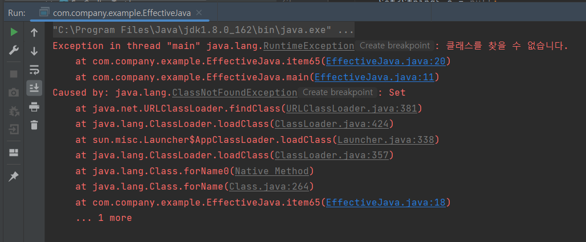

# item65. Reflection보다는 Interface를 사용하라.

Reflection이란? 런타임 시에 클래스의 메타 정보를 얻는 기능을 말한다.

클래스가 가지고 있는 필드가 무엇인지, 어떤 생성자를 갖고 있는지, 어떤 메소드를 갖고 있는지, 적용된 어노테이션이 무엇인지 알아내는 것이 리플렉션이다.

java.lang.reflect 의 리플렉션 기능을 이용하면 프로그램에서 임의의 클래스에 접근할 수 있다.

Class 객체로 가져올 수 있는 인스턴스

* Constructor
* Method
* Field

위 인스턴스들로는 그 클래스의 멤버 이름, 필드 타입, 메소드 시그니처 등을 가져올 수 있다.

또한, 이 인스턴스들을 이용해 각각에 연결된 실제 생성자, 메소드, 필드를 조작할 수도 있다. 이 인스턴스들을 통해 해당 클래스의 인스턴스를 생성하거나, 메소드를 호출하거나, 필드에 접근할 수 있다는 뜻이다.

리플렉션을 이용하면 컴파일 당시에 존재하지 않던 클래스도 이용할 수 있다.

#### Reflection의 단점

1. **컴파일타임 type 검사가 주는 이점을 하나도 누릴 수 없다.** (예외 검사도 마찬가지)
   * 프로그램이 리플렉션 기능을 써서 존재하지 않는 혹은 접근할 수 없는 메소드를 호출하려 시도하면 런타임 오류가 발생한다. (주의해서 대비 코드를 작성해 두어야 함)
2. **코드가 지저분하고 장황해진다.**
3. **성능이 떨어진다.**
   * 리플렉션을 통한 메소드 호출은 일반 메소드 호출보다 훨씬 느리다. (고려해야하는 요소가 많아 정확한 차이는 이야기하기 어려움). 입력 매개변수가 없고 int를 반환하는 메소드로 실험해 보니 11배나 느렸다고 함.

**리플렉션은 아주 제한된 형태로만 사용해야 그 단점을 피하고 이점만 취할 수 있다.**

컴파일 타임에 이용할 수 없는 클래스를 사용해야만 하는 프로그램은 비록 컴파일타임이라도 적절한 인터페이스나 상위 클래스를 이용할 수는 있을 것이다. (아이템 64)

**리플렉션은 인스턴스 생성에만 쓰고, 이렇게 만든 인스턴스는 인터페이스나 상위 클래스로 참조해 사용하자.**

```java

public static void main(String[] args) {
    // argument로 들어온 클래스 이름을 통해 Class 객체로 변환
    Class<? extends Set<String>> cl = null;
    try {
        cl = (Class<? extends Set<String>>) Class.forName(args[0]);
    } catch (ClassNotFoundException e) {
        throw new RuntimeException("클래스를 찾을 수 없습니다." , e);
    }

    // 생성자를 얻는다.
    Constructor<? extends Set<String>> cons = null;
    try {
        cons = cl.getDeclaredConstructor(); // 해당 클래스에 선언된 매개변수 없는 생성자를 가져옴
    } catch (NoSuchMethodException e) {
        throw new RuntimeException("매개변수 없는 생성자를 찾을 수 없습니다.", e);
    }

    // Set 인스턴스를 만든다.
    Set<String> s = null;
    try {
        s = cons.newInstance();
    } catch (InvocationTargetException e) {
        throw new RuntimeException("생성자가 예외를 던졌습니다.", e);
    } catch (InstantiationException e) {
        throw new RuntimeException("클래스를 인스턴스화할 수 없습니다.", e);
    } catch (IllegalAccessException e) {
        throw new RuntimeException("생성자에 접근할 수 없습니다.", e);
    } catch (ClassCastException e) {
        throw new RuntimeException("Set을 구현하지 않은 클래스입니다.", e);
    }

    // 생성한 Set을 사용한다.
    s.addAll(Arrays.asList(args).subList(1, args.length));
    System.out.println(s);
}
```

위 예시는 2가지의 단점을 보인다.

1.  런타임에 총 6가지나 되는 예외를 던질 수 있다.


    그 모두가 인스턴스를 리플렉션 없이 생성했다면 컴파일타임에 잡아낼 수 있었을 예외들이다.

    \-→ InvocationTargetException은 아무리 해도 안 나오는데..? 공책임님 말로는 생성자가 public이지만 바로 throw를 해버려서 그 생성자를 못 쓰게 만든 경우도 있다고 함. 그럴 경우에는 저 Exception이 날 것 같음.

    1.  &#x20;args: Set


        <figure><figcaption></figcaption></figure>
    2.  args: java.util.Set (NoSuchMethodException)\


        <figure><figcaption></figcaption></figure>
    3.  args: jata.util.EnumSet\
        (InstantiationException: 해당 클래스가 추상클래스이거나 인터페이스인 경우)


        <figure><figcaption></figcaption></figure>
    4.  args: java.util.AbstractSet

        ```java
        Exception in thread "main" java.lang.RuntimeException: 생성자에 접근할 수 없습니다.
        	at com.company.example.EffectiveJava.item65(EffectiveJava.java:40)
        	at com.company.example.EffectiveJava.main(EffectiveJava.java:11)
        Caused by: java.lang.IllegalAccessException: Class com.company.example.EffectiveJava can not access a member of class java.util.AbstractSet with modifiers "protected"
        	at sun.reflect.Reflection.ensureMemberAccess(Reflection.java:102)
        	at java.lang.reflect.AccessibleObject.slowCheckMemberAccess(AccessibleObject.java:296)
        	at java.lang.reflect.AccessibleObject.checkAccess(AccessibleObject.java:288)
        	at java.lang.reflect.Constructor.newInstance(Constructor.java:413)
        	at com.company.example.EffectiveJava.item65(EffectiveJava.java:34)
        	... 1 more
        ```


    5.  args: java.util.ArrayList\


        <figure><figcaption></figcaption></figure>
2. 클래스 이름만으로 인스턴스를 생성해내기 위해 무려 25줄이나 되는 코드를 작성했다. 리플렉션이 아니라면 생성자 호출 한 줄로 끝났을 일이다.
   * 참고로, 리플렉션 예외 각각을 잡는 대신 모든 리플렉션 예외의 상위 클래스인 `ReflectiveOperationException`을 잡도록 하여 코드 길이를 줄일 수는 있다.

두 단점 모두 객체를 생성하는 부분에만 국한된다. 객체가 일단 만들어지면 그 후의 코드는 여타의 Set 인스턴스를 사용할 때와 똑같다. 그래서 실제 프로그램에서는 이런 제약에 영향 받는 코드는 일부에 지나지 않는다.

이 프로그램을 컴파일하면 Unchekced Cast 경고가 뜬다.

*

    <figure><figcaption></figcaption></figure>

하지만 `Class<? extends Set<String>>` 으로의 형변환은 심지어 명시한 클래스가 Set을 구현하지 않았더라도 성공한다. 단, 그 클래스의 인스턴스를 생성하려 할 때 `ClassCastException`을 던지게 된다. 이 경고를 숨기는 방법은 아이템 27 참고.

* **item27. @SuppressWarnings(”unchecked”) 어노테이션을 사용해 경고 숨기기**
  * 단, 타입 안전성을 확신할 수 있을 경우에만 해당 어노테이션 사용 필요
  * 해당 어노테이션을 사용했다면 반드시 그 경고를 무시해도 안전한 이유를 주석으로 남겨야 한다. 다른 사람이 그 코드를 이해하는데 도움이 되며, 다른 사람이 그 코드를 잘못 수정하여 타입 안전성을 잃는 상황을 줄여주기 때문이다.

드물긴 하지만, 리플렉션은 런타임에 존재하지 않을 수도 있는 다른 클래스, 메소드, 필드와의 의존성을 관리할 때 적합하다.

이 기법은 버전이 여러 개 존재하는 외부 패키지를 다룰 때 유용하다. 가동할 수 있는 최소한의 환경, 즉 주로 가장 오래된 버전만을 지원하도록 컴파일한 후, 이후 버전의 클래스와 메소드 등은 리플렉션으로 접근하는 방식이다.

이렇게 하려면 접근하려는 새로운 클래스나 메소드가 런타임에 존재하지 않을 수 있다는 사실을 반드시 감안해야 한다. 즉, 같은 목적을 이룰 수 있는 대체 수단을 이용하거나 기능을 줄여 동작하는 등의 적절한 조치를 취해야 한다.

핵심 정리

* 리플렉션은 복잡한 특수 시스템을 개발할 때 필요한 강력한 기능이지만, 단점도 많다. 컴파일타임에는 알 수 없는 클래스를 사용하는 프로그램을 작성한다면 리플렉션을 사용해야 할 것이다. 단, 되도록 객체 생성에만 사용하고, 생성한 객체를 이용할 때는 적절한 인터페이스나 컴파일타임에 알 수 있는 상위 클래스로 형변환해 사용해야 한다.

aspectj 예시 보여주기
